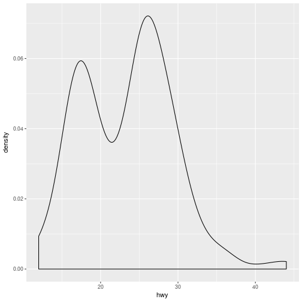
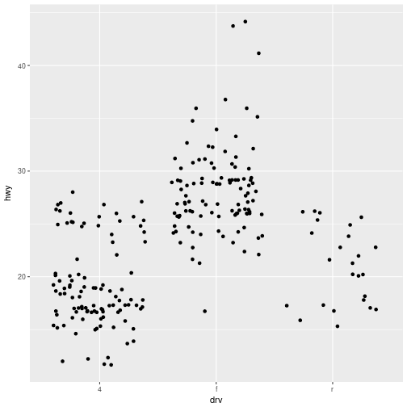
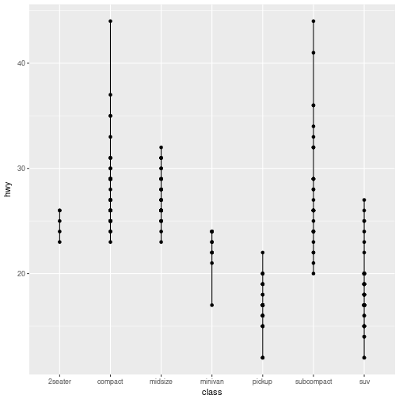
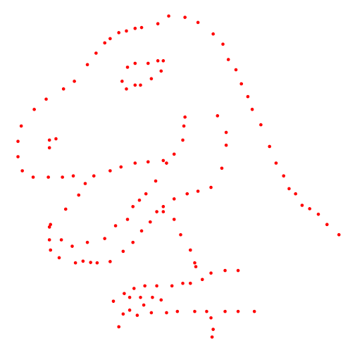

Grafiken in R mit ggplot2
========================================================
author: Matthias Weiler
date: 13.02.2018
autosize: true
transition: concave

Folien und Datensatz
========================================================

https://mrweiler.github.io/gir  
https://github.com/mrweiler/gir/blob/master/Graphics_in_R.R

Grundlagen
========================================================
type: section

Grafiken mit ggplot()
========================================================
Drei Kernkomponenten:
- Data
- Aesthetic mappings
- Geometric objects

ggplot()
========================================================


```r
ggplot()
```


+ data
========================================================

```r
ggplot(data = mpg)
```


+ aesthetic mappings
========================================================

```r
ggplot(data = mpg, aes(x = displ, y = hwy))
```


+ geometric objects
========================================================

```r
ggplot(data = mpg, aes(x = displ, y = hwy)) + 
  geom_point()
```


und nochmal ...
========================================================

ggplot()
========================================================


```r
ggplot()
```


+ data
========================================================

```r
ggplot(data = mpg)
```


+ aesthetic mappings
========================================================

```r
ggplot(data = mpg, aes(x = manufacturer))
```


+ geometric objects
========================================================

```r
ggplot(data = mpg, aes(x = manufacturer)) + 
  geom_bar()
```


Und jetzt seid Ihr dran!
========================================================
Bitte erstellt mit den Variablen "cyl"  
und "cty" aus dem "mpg"-Datensatz ein  
Streudiagramm.

Auflösung
========================================================

```r
ggplot(data = mpg, aes(x = cyl, y = cty)) + 
  geom_point()
```


Weitere "geometric objects"
========================================================
type: section

Histogramme
========================================================

```r
ggplot(data = mpg, aes(x = hwy)) + 
  geom_histogram()
```


Häufigkeitspolygone
========================================================

```r
ggplot(data = mpg, aes(x = hwy)) + 
  geom_freqpoly()
```


Densityplots
========================================================

```r
ggplot(data = mpg, aes(x = hwy)) + 
  geom_density()
```



Scatterplots
========================================================

```r
ggplot(data = mpg, aes(x = displ, y = hwy)) + 
  geom_point()
```


Liniendiagramme
========================================================

```r
ggplot(data = mpg, aes(x = displ, y = hwy)) + 
  geom_line()
```


Scatterplots
========================================================

```r
ggplot(data = mpg, aes(x = drv, y = hwy)) + 
  geom_point()
```


Jitterplots
========================================================

```r
set.seed(123)
ggplot(data = mpg, aes(x = drv, y = hwy)) + 
  geom_jitter()
```



Boxplots
========================================================

```r
ggplot(data = mpg, aes(x = drv, y = hwy)) + 
  geom_boxplot()
```


Violinplots
========================================================

```r
ggplot(data = mpg, aes(x = drv, y = hwy)) + 
  geom_violin()
```


Beeswarmplots
========================================================

```r
ggplot(data = mpg, aes(x = drv, y = hwy)) + 
  ggbeeswarm::geom_beeswarm()
```


Maps
========================================================

```r
ggplot(map_data("world"), aes(long, lat, group = group)) +
  geom_polygon() 
```


Kombinationen
========================================================
type: section

Histogramm
========================================================

```r
ggplot(data = mpg, aes(x = hwy)) + 
  geom_histogram()
```


+ Häufigkeitspolygon
========================================================

```r
ggplot(data = mpg, aes(x = hwy)) + 
  geom_histogram() +
  geom_freqpoly()
```


Scatterplot
========================================================

```r
ggplot(data = mpg, aes(x = displ, y = hwy)) + 
  geom_point()
```


+ Regressiongrade
========================================================

```r
ggplot(data = mpg, aes(x = displ, y = hwy)) + 
  geom_point() +
  geom_smooth(method = "lm", se = FALSE)
```


+ weitere Regressiongrade mit Konfidenzinterval
========================================================

```r
ggplot(data = mpg, aes(x = displ, y = hwy)) + 
  geom_point() +
  geom_smooth(method = "lm", se = FALSE) +
  geom_smooth(method = "loess", se = TRUE)
```


Violinplot
========================================================

```r
ggplot(data = mpg, aes(x = drv, y = hwy)) + 
  geom_violin()
```


+ Boxplot
========================================================

```r
ggplot(data = mpg, aes(x = drv, y = hwy)) + 
  geom_violin() +
  geom_boxplot(width = 0.1)
```


Und jetzt seid Ihr dran!
========================================================
Bitte erstellt mit den Variablen "class"  
und "cty" aus dem "mpg"-Datensatz ein  
Streudiagramm und legt ein Liniendiagramm  
darüber.

Auflösung
========================================================

```r
ggplot(data = mpg, aes(x = class, y = hwy)) + 
  geom_point() +
  geom_line()
```



Achsen anpassen
========================================================
type: section

Achsenlimits
========================================================

```r
ggplot(data = mpg, aes(x = displ, y = hwy)) + 
  geom_point() +
  scale_x_continuous(limits = c(0, 10))
```


Achsenlimits (Alternative)
========================================================

```r
ggplot(data = mpg, aes(x = displ, y = hwy)) + 
  geom_point() +
  xlim(0, 10)
```


Achsenlabels
========================================================

```r
ggplot(data = mpg, aes(x = displ, y = hwy)) + 
  geom_point() +
  labs(x = "Hubraum", y = "Kraftstoffeffizienz")
```


Achsenlabels (Alternative)
========================================================

```r
ggplot(data = mpg, aes(x = displ, y = hwy)) + 
  geom_point() +
  xlab(label = "Hubraum") +
  ylab(label = "Kraftstoffeffizienz")
```


Keine Achsenlabels
========================================================

```r
ggplot(data = mpg, aes(x = displ, y = hwy)) + 
  geom_point() +
  labs(x = "", y = "")
```


Gar keine Achsenlabels
========================================================

```r
ggplot(data = mpg, aes(x = displ, y = hwy)) + 
  geom_point() +
  labs(x = NULL, y = NULL)
```


Achsenskala
========================================================

```r
ggplot(data = mpg, aes(x = displ, y = hwy)) + 
  geom_point() +
  scale_x_continuous(limits = c(0, 10), breaks = c(0:10))
```


Keine Achsenskala
========================================================

```r
ggplot(data = mpg, aes(x = displ, y = hwy)) + 
  geom_point() +
  scale_x_continuous(limits = c(0, 10), breaks = NULL)
```


Weitere Beschriftungen
========================================================
type: section

Titel
========================================================

```r
ggplot(data = mpg, aes(x = displ, y = hwy)) + 
  geom_point() +
  ggtitle(label = "Mein Titel")
```


Titel (Alternative)
========================================================

```r
ggplot(data = mpg, aes(x = displ, y = hwy)) + 
  geom_point() +
  labs(title = "Mein Titel")
```


Legende
========================================================

```r
ggplot(data = mpg, aes(x = displ, y = hwy, color = class)) + 
  geom_point() +
  labs(color = "Meine Legende")
```


Und jetzt seid Ihr dran!
========================================================
Bitte erstellt eine leere Grafik mit  
einem Titel und einem Untertitel.

Auflösung
========================================================

```r
ggplot() + 
  labs(title = "Mein Titel", subtitle = "Mein Untertitle")
```


Themes
========================================================
type: section

Black-White
========================================================

```r
ggplot(data = mpg, aes(x = displ, y = hwy)) + 
  geom_point() +
  theme_bw()
```


Classic
========================================================

```r
ggplot(data = mpg, aes(x = displ, y = hwy)) + 
  geom_point() +
  theme_classic()
```


Leer
========================================================

```r
ggplot(data = mpg, aes(x = displ, y = hwy)) + 
  geom_point() +
  theme_void()
```


Letzte Grafik mit hellblauem Hintergrund
========================================================

```r
last_plot() + 
  theme(panel.background = element_rect(fill = "lightblue"))
```


... mit schwarzen Achsen und Skala
========================================================

```r
last_plot() + 
  theme(axis.line = element_line(colour = "black"),
        axis.ticks = element_line(colour = "black"))
```


... mit Achsenbeschriftung
========================================================

```r
last_plot() + 
  theme(axis.text = element_text(colour = "blue"))
```


Und jetzt seid Ihr dran!
========================================================
Bitte erstellt folgende Grafik:  


Auflösung
========================================================

```r
ggplot() + 
  ggtitle(label = "Fast", subtitle = "fertig") +
  theme(title = element_text(colour = "white", face = "bold", size = 50), 
        panel.background = element_rect(fill = "yellow"),
        plot.background = element_rect(fill = "blue"))
```

Noch Fragen?
========================================================

Literatur
========================================================
Wickham, H. (2016). ggplot2: Elegant Graphics for Data Analysis. Springer.

Fertig
========================================================

